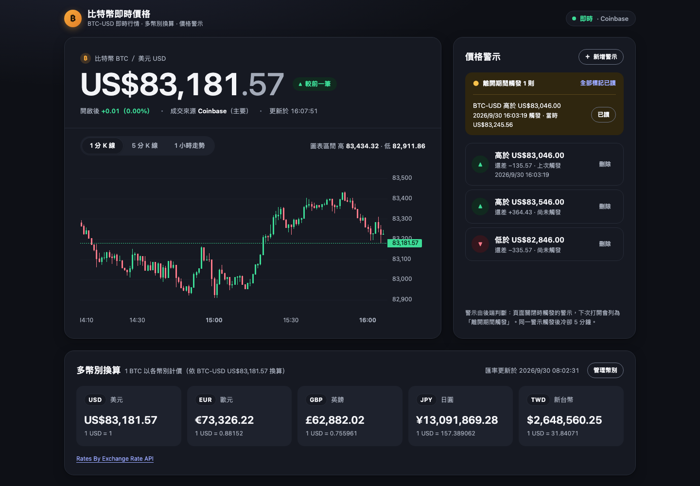
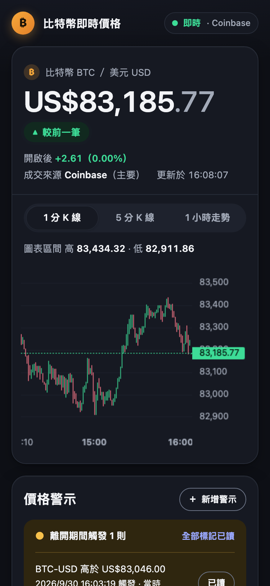
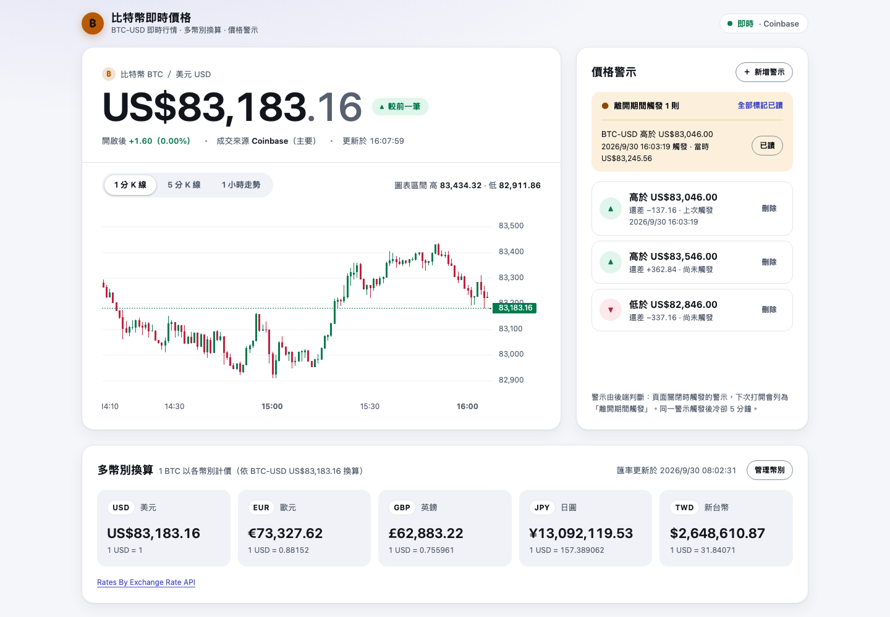
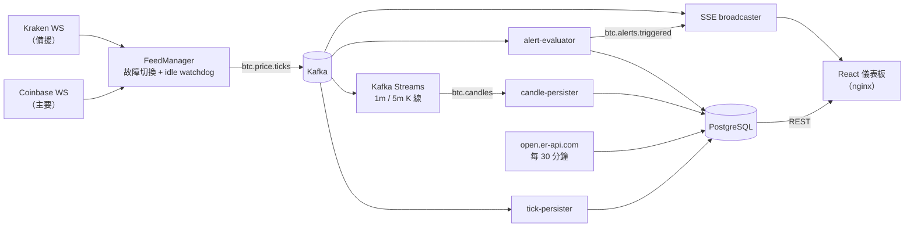

# cube_test — 即時比特幣價格儀表板

從 Coinbase / Kraken 的公開 WebSocket 接收 BTC-USD 逐筆成交，經 **Kafka / Kafka Streams** 即時算出 K 線、判斷價格警示，並用 **Server-Sent Events** 推到 React 儀表板；主要來源斷線時自動切換到備援交易所。整套系統 `docker compose up` 一鍵啟動，不需要任何 API key。



| 手機（375px） | 淺色主題 |
|---|---|
|  |  |

## 功能亮點

- **即時價格**：逐筆成交經 SSE 推到瀏覽器，較前一筆的漲跌以綠／紅標示，並顯示開啟頁面後的累計漲跌；資料延遲或斷線時畫面會明確提示，不會把舊價格當成即時價格。
- **雙來源自動故障切換**：Coinbase 為主、Kraken 為 hot standby。主來源失效約 10 秒內切換，恢復並穩定 15 秒後自動切回，不需要重啟。
- **K 線與走勢**：Kafka Streams 以**成交時間**聚合 1 分／5 分 OHLC，與資料庫逐筆價格完全一致；走勢圖由伺服器端降採樣。滑鼠移到 K 線上可看該根的開高低收。
- **多幣別換算**：以真實匯率（open.er-api.com）把 BTC-USD 換算成資料庫裡的每個幣別，並顯示匯率更新時間；幣別可在畫面上新增、修改、刪除。
- **價格警示（含未讀）**：由後端判斷，5 分鐘冷卻；每筆警示顯示距離目前價格還差多少；頁面沒開時觸發的警示會列為「離開期間觸發」，下次打開時顯示。
- **可上 K8s 的基礎**：多架構 image（amd64 / arm64）、所有設定走環境變數、liveness / readiness 分離。

## 架構



- 後端是一個 Spring Boot 模組化單體，各區塊只透過 Kafka topic 溝通；ingest、Streams、寫入、警示都有功能開關，之後可以拆成不同 Deployment。
- 網路分成 `internal`（無法連外）與 `egress`（只有 backend），「哪個服務可以連網際網路」是明確、可測試的設定。

## 技術棧

| 層 | 技術 |
|---|---|
| 後端 | Java 21、Spring Boot 3.5、Spring Kafka、Kafka Streams、JDK `java.net.http.WebSocket` |
| 資料 | Apache Kafka 3.9（KRaft 單節點）、PostgreSQL 17 + Flyway |
| 前端 | React 19 + TypeScript + Vite、[TradingView Lightweight Charts™](https://www.tradingview.com/)、純 CSS design tokens |
| 測試 | JUnit 5、Testcontainers（Kafka / PostgreSQL）、Kafka Streams `TopologyTestDriver`、Vitest + Testing Library + MSW |
| 部署 | Docker multi-arch（amd64 / arm64）、docker compose、nginx（unprivileged） |

## 技術重點與學到的東西

- **事件時間 + grace + suppress**：K 線依交易所成交時間（而不是 Kafka 收到的時間）切視窗，遲到 5 秒內仍計入；`suppress(untilWindowCloses)` 讓每根 K 線只輸出一次定稿值。open／close 的排序規則 `(event_time, received_at, event_id)` 與 SQL 相同——實作時還發現 Java 的 `UUID.compareTo` 是**有號**比較、PostgreSQL 是**無號**，不統一就會對不上。
- **Hot-standby 故障切換與 idle watchdog**：兩條連線同時保持；健康 = 10 秒內有任何訊息（含 heartbeat）且 60 秒內有成交。真實斷網常是 half-open（socket 看起來還開著），所以 client 在沒有任何訊息時主動中斷重連，並用指數退避。
- **SSE 節流**：每個 instance 用自己的 consumer group 從 latest 讀；價格只保留最新值、每 250 ms 推一次，一批成交的最後一筆一定會送出。
- **冪等寫入與不遺失**：逐筆以 `ON CONFLICT (event_id) DO NOTHING` 寫入（event id 由 `source + trade_id` 決定）；寫 DB 的 consumer 在資料庫中斷時無限指數退避重試，壞資料則逐筆隔離不卡住後面。
- **Keyset 分頁**：歷史價格以 `(event_time, id)` 續查，每頁成本相同、結果穩定；走勢用 PostgreSQL `date_bin` 在伺服器端降採樣。
- **離線可跑的測試策略**：測試不連任何真實外部來源（`test` profile + 守門測試）；Kafka / PostgreSQL 用 Testcontainers，Streams 用 `TopologyTestDriver`，WebSocket 用本機假交易所；前後端以 [`contracts/api-samples/`](contracts/api-samples/) 契約樣本互相約束；測試以 random order 反覆驗證不相依執行順序。

## 快速開始

```bash
git clone <repo-url> && cd cube_test
docker compose up -d --build --wait      # 第一次約 5 分鐘
open http://localhost:3000               # 30 秒內可看到跳動的 BTC-USD 價格
docker compose down                      # 停止（保留資料；加 -v 會清除）
```

需要 Docker Desktop。port 被占用時用 `FRONTEND_PORT=3001 BACKEND_PORT=8081 docker compose up -d --wait`。完整說明見 [docs/configuration.md](docs/configuration.md)。

## 開發與測試

```bash
./mvnw clean verify                      # 後端（需 JDK 21 + Docker；不需安裝 Maven）
cd frontend && npm ci && npm test        # 前端
```

- [docs/testing.md](docs/testing.md)：開發方式、離線跑測試、多架構 image 建置
- [docs/configuration.md](docs/configuration.md)：需要的工具、服務與網路、所有環境變數、常見問題
- [docs/api.md](docs/api.md)：REST 與 SSE API
- [docs/acceptance.md](docs/acceptance.md)：AC1–AC15 逐條驗收步驟

## 開發方式：spec-driven + 工程師／QA 雙 agent

這個專案用 spec-driven 流程開發：**specify → plan → tasks → implement**，每一步都要使用者（或其授權的 team lead）確認才往下走。

- [spec.md](specs/realtime-btc-kafka-react/spec.md)：需求與 15 條 Acceptance Criteria
- [plan.md](specs/realtime-btc-kafka-react/plan.md)：技術方案、替代方案、風險
- [tasks.md](specs/realtime-btc-kafka-react/tasks.md)：拆成可驗證的 task，每個都有 done-when
- [progress.md](specs/realtime-btc-kafka-react/progress.md)：工程師的交付紀錄（每個 task 的 commit、驗證方式與學到的概念）
- [qa-review.md](specs/realtime-btc-kafka-react/qa-review.md)：QA 的審查紀錄

實作由兩個 Claude agent 互相驗證：工程師 agent 每完成一個 task 就 commit 並交給 QA agent；QA 在獨立 worktree 實際 build / test、做反向驗證，判定 PASS / FAIL / CONCERN。FAIL 必須先修好才能做下一個 task；偏離 spec / plan 的改動要回到使用者決定。

## Roadmap

- **Kubernetes 部署**：Deployment / Service / Ingress、liveness / readiness probe、ingest 以單一副本執行（下一份 spec）
- **GitHub Actions CI/CD**：`./mvnw verify` 與前端測試、multi-arch image 建置與推送（下一份 spec）

## 專案結構

```
src/main/java/com/currency/demo/
  feed/      交易所 WebSocket client、訊息解析、FeedManager（主備切換）、故障注入端點
  pricing/   逐筆價格寫入與查詢、保留期清除、來源狀態追蹤
  candle/    Kafka Streams K 線 topology、K 線寫入與查詢
  fx/        匯率抓取與多幣別換算
  alert/     價格警示規則、判斷、API
  stream/    SSE 推播
  currency/  幣別 CRUD
  health/    Kafka / Kafka Streams 健康檢查
  config/    設定、Kafka topics、consumer 設定
src/main/resources/db/migration/   Flyway schema（V1–V6）
frontend/                          React + TypeScript（Vite）、nginx 設定
contracts/api-samples/             API 回應契約樣本
docs/                              設定、API、測試、驗收步驟與驗收用 SQL
specs/realtime-btc-kafka-react/    規格、計畫、任務、進度與 QA 紀錄
```
