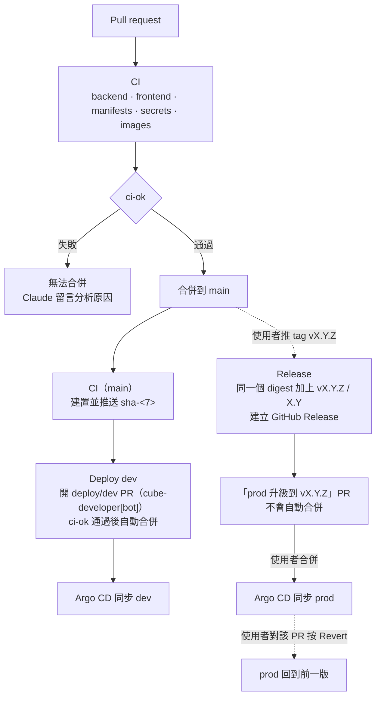

# CI/CD

[← 回到 README](../README.md) · [設定](configuration.md) · [API](api.md) · [測試](testing.md) · [Kubernetes](kubernetes.md) · [CI/CD](cicd.md) · [驗收步驟](acceptance.md)

本頁說明 GitHub Actions 的 CI、dev 自動部署、版本發布與 prod 升級、回滾，以及要在 GitHub 上做的設定。叢集本身見 [kubernetes.md](kubernetes.md)。

## 流程



| Workflow | 觸發 | 做什麼 |
|---|---|---|
| `ci.yml` | PR、push 到 main、手動 | 見下方〈CI〉；`ci-ok` 是 main 唯一的必要 check |
| `deploy-dev.yml` | CI 在 main 成功（push 或手動執行） | 把 `overlays/dev` 指到新 image（tag + digest），在固定分支 `deploy/dev` 開 PR 並開啟 auto-merge；不會讓 dev 退版 |
| `release.yml` | 推送 `vX.Y.Z` tag | 檢查後把 dev 跑的 image 加上版本 tag，建立 Release，開 prod 升級 PR |
| `claude-review.yml` | 非 draft 的 PR | Claude 自動 review（一則持續更新的留言 + inline suggestion） |
| `claude.yml` | 留言 `@claude` | Claude 回答問題或給 suggestion，**只留言、不 commit** |
| `claude-ci-failure.yml` | CI 失敗 | Claude 讀失敗的 log，在 PR 留言分析；main 失敗時寫入 issue「main CI 失敗」 |
| `dependabot.yml` | 每週 | maven、npm、GitHub Actions、Docker 的相依更新 PR |

## CI

| Job | 內容 |
|---|---|
| `changes` | 判斷是否只改了 `deploy/`、`docs/`、`specs/`、`*.md`；是的話跳過建置與測試（手動執行一律視為有程式變更） |
| `backend` | `./mvnw -B verify`（Testcontainers 啟動 Kafka 與 PostgreSQL）；另外檢查 Tomcat 版本覆寫是否還需要（見〈需要人工追蹤〉） |
| `frontend` | `npm ci`、test、lint、build |
| `manifests` | kustomize + kubeconform（含 CRD schema）、Argo CD Application 與 `components.tsv` 一致、`promtool` 告警規則測試、防降版與發布檢查腳本的測試、actionlint |
| `secrets` | gitleaks 掃描整個歷史（只允許 `*.sealed.yaml` 的密文） |
| `images` | backend / frontend 建置 linux/amd64 + linux/arm64，Trivy 掃描：報告上傳到 Security 分頁，**有修補版本的 CRITICAL 漏洞會讓 job 失敗**；只有 main（push 或手動執行）會推送到 GHCR |
| `ci-ok` | 彙總：任何 job 失敗或取消就失敗，跳過的 job 視為通過 |

安全設計：PR 上不使用任何 secret（Dependabot 的 PR 也跑完整 CI）；所有第三方 action 都用 commit SHA 固定版本；workflow 預設沒有任何權限，每個 job 只要求需要的權限。

## GitHub 設定（一次性）

以下由 repo 擁有者在 GitHub 網頁上設定。

1. **Actions 權限**：Settings → Actions → General → Workflow permissions 選 **Read repository contents and packages permissions**。
2. **允許 auto-merge**：Settings → General → Pull Requests，勾選 **Allow auto-merge**。
3. **保護 main**：Settings → Rules → Rulesets → New branch ruleset，Target 選預設分支，Enforcement 設為 Active，勾選：
   - Restrict deletions、Block force pushes；
   - Require a pull request before merging（Required approvals 可以是 0）；
   - Require status checks to pass，加入 `ci-ok`（來源選 GitHub Actions）。
   - **不要**設定 bypass list。
4. **部署用的 GitHub App**（deploy-dev 與 release 用它開 PR。用 workflow 內建的 token 開的 PR 不會觸發 CI，必要 check 永遠不會出現）：
   - Settings（個人帳號）→ Developer settings → GitHub Apps → New GitHub App。名稱例如 `cube-developer`，Homepage URL 填 repo 網址即可，**取消勾選 Webhook Active**。
   - Repository permissions：**Contents: Read and write**、**Pull requests: Read and write**，其他維持 No access。
   - 建立後記下 App ID，在頁面下方 Generate a private key 下載 `.pem`；左側 Install App 安裝到這個 repo。
   - repo → Settings → Secrets and variables → Actions，新增 `DEPLOYER_APP_ID`（App ID）與 `DEPLOYER_APP_PRIVATE_KEY`（`.pem` 的完整內容）。
5. **Labels**：建立 `deploy/dev`、`deploy/prod`、`test-only`（Release 變更說明會排除這些 PR）。
6. **GHCR**：第一次 CI 在 main 推送 image 後，到你的帳號 → Packages，把 `cube-backend`、`cube-frontend` 的 visibility 改成 **Public**（叢集沒有 pull secret）。
7. **Code security**：Settings → Code security，開啟 Dependabot alerts、Dependabot security updates、Secret scanning 與 Push protection。
8. **Claude Code**：
   - 只需要一個 repo secret：執行 `claude setup-token` 產生 token，存成 `CLAUDE_CODE_OAUTH_TOKEN`（或改用 API key，存成 `ANTHROPIC_API_KEY`）。
   - **不需要安裝 Claude GitHub App**：三個 workflow 都改用 workflow 自己的 token（只有讀取權限，加上留言所需的權限）留言，留言者會顯示為 github-actions[bot]。App 預設有 Contents 寫入權限，已經裝了的話可以解除安裝，或把權限降到只讀。
   - 本機 `claude` 的 `/install-github-app` 可以幫你設定 secret，但它會另外開一個加入預設 workflow 的 PR，**不要合併**：這個 repo 已經有自己的、只能留言的版本。
   - 在 Anthropic Console 設定每月用量上限。

## 發布新版本與 prod 升級

前提：dev 已經跑在想要發布的版本上，而且那個 image 的 commit 通過了 `ci-ok`（dev 部署 PR 合併後就符合）。

1. **找到要發布的 commit**：通常是 main 上最新的 `deploy(dev): sha-<7>` commit（tag 可以打在只改 deploy 或文件的 commit 上，release 會使用該 commit 上 dev 的 image）：
   ```bash
   git fetch origin
   git log --oneline -5 origin/main
   ```
2. **推送 tag**（用 commit 的 hash 固定位置，避免 main 剛好有新的 commit）：
   ```bash
   git tag -a vX.Y.Z <commit> -m "vX.Y.Z"
   git push origin vX.Y.Z
   ```
3. **Release workflow** 會：
   - 確認 tag 在 main 上，讀出該 commit 上 `overlays/dev` 的 image，並確認那些 image 的 commit 通過 `ci-ok`（任何一項不符合都會失敗，不會發布）；
   - 把**同一個 digest** 加上 `vX.Y.Z` 與 `X.Y` tag，不重新建置；
   - 建立 GitHub Release，變更說明依 `.github/release.yml` 分類；
   - 開「prod 升級到 vX.Y.Z」PR：只改 `overlays/prod`，label `deploy/prod`，**不開 auto-merge**。
4. **合併 prod 升級 PR**（CI 綠燈後，建議用 Create a merge commit）。Argo CD 約 1–2 分鐘內把 prod 換成新版本。合併之前 prod 不會有任何變化。
5. **確認**：
   ```bash
   kubectl -n cube-prod get pods -o jsonpath='{range .items[*]}{.metadata.name} {.spec.containers[0].image}{"\n"}{end}'
   ```

### 回滾

在 GitHub 打開該次的「prod 升級到 vX.Y.Z」PR，按 **Revert**，GitHub 會開一個 revert PR。CI 綠燈後合併，Argo CD 會把 prod 換回前一版（同樣的 digest）。

## Dependabot

- 每週檢查 maven、npm（`frontend/`）、GitHub Actions、Docker base image；minor / patch 依 ecosystem 合併成一個 PR。
- **不開大版本（major）升級 PR**：每個大版本升級都另開 spec 處理。這只影響一般的版本更新，**安全更新不受影響**，仍然會開 PR。
- Dependabot 的 PR 跑完整 CI（不需要 secret），Claude 不會自動 review 它們。

## Claude Code

- 自動 review：PR 開啟、更新或標為 ready for review 時執行；fork、draft、Dependabot、cube-developer[bot] 與 `deploy/*` 分支都會跳過。
- `@claude`：在 PR 或 issue 留言提問。Claude **只能留言**：要它改程式碼時，它會留下 ```suggestion 區塊，由你在 GitHub 上按 Commit suggestion。它不能 commit、push、合併或核准 PR（workflow 用的是只有讀取權限的 token，工具也只允許讀取與留言）。
- CI 失敗分析：只讀 log，不 checkout、不執行 PR 的程式碼；Dependabot 觸發的失敗會跳過。
- 成本：每個 workflow 都有 `--max-turns` 上限與 concurrency；實測一次 review 約 0.2 USD，一次問答或失敗分析約 0.07–0.11 USD。

## 需要人工追蹤

- **Tomcat 版本覆寫**：`pom.xml` 的 `<tomcat.version>` 為了修補 CVE 覆寫了 Spring Boot 管理的版本。Dependabot 追蹤不到這個屬性（只有 Spring Boot BOM 用到它）。CI 的 backend job 會在「目前的 Spring Boot 已經管理同樣或更新的 Tomcat」時發出警告，看到警告就移除這個覆寫。讀不到 BOM 時也會警告，這時請人工確認。

## 已知限制

- 「已有 dev 部署 PR 開著時，第二次升級改為更新同一個 PR」：已實測（2026-10-05）。同一個 PR 被 force-push、標題與 diff 都換成新的 image，auto-merge 重新開啟，dev 最後是比較新的版本。實際上很少發生：main 的 CI 一次只跑一個，第一個部署 PR 通常在第二個 image 建好之前就合併了。
- **人開的 PR 可能不小心改到 overlay 的 image**：如果 PR 分支落後 main（例如 dev / prod 已經被 bump 過），PR 的 diff 會把 `overlays/*/kustomization.yaml` 的 image 改回舊版，合併後 dev 或 prod 就會退版。目前 CI 沒有檢查這件事，只能在開 PR 前先把 main 合併進來，並確認 `git diff --stat origin/main` 裡沒有 overlays（2026-10-05 實際差點發生）。建議之後在 CI 加檢查（見 README 的 Roadmap）。
- 只改 `deploy/`、`docs/`、`specs/`、`*.md` 的合併不會建置 image，dev 也不會更新；需要時在 main 上手動執行 CI。

## 歷史改寫後的恢復步驟

改寫 main 的歷史（例如清除 commit trailer）並 force push 之後，所有舊的 commit hash 都會改變。dev / prod overlay 裡的 image tag `sha-<7>` 指向的 commit 已經不存在了。image 本身還在 GHCR 上，而且是用 digest 指定的，所以執行中的 dev / prod **不受影響**。但有兩件事會卡住：

- **發布會失敗**：`release.yml` 會確認 dev overlay 裡的 image 是從哪個 commit 建置的，以及那個 commit 的 `ci-ok` 是否通過。commit 找不到時，會出現錯誤 `commit … is not in the repository's history (rewritten?)`。
- **只改文件的 commit 不會觸發重建**：只動到 `deploy/`、`docs/`、`specs/`、`*.md` 時，CI 不會建置 image，dev 也就不會更新。

恢復順序如下（不能跳步驟）：

1. **重新啟用 main 的 ruleset**（改寫期間暫時停用的那份）。
2. **在 main 上手動執行 CI**：GitHub → Actions → CI → Run workflow，分支選 `main`。也可以用指令：
   ```bash
   gh workflow run ci.yml --ref main
   ```
   手動執行時，CI 一律視為有程式變更，會跑完整的測試，並建置與掃描（Trivy）image，再推送 `sha-<HEAD 的 7 碼>`。在其他分支手動執行時不會推送。
3. **等 dev 自動更新**：CI 綠燈後，`Deploy dev` 會由 workflow_run 觸發。因為 overlay 裡舊的 sha 已經不在歷史中，防降版檢查（`scripts/dev-bump-decision.sh`）會判定為 `bump-unknown-current` 並允許更新。bump PR 會註明 `current sha … not found in the history of main (rewritten?); allowing bump`，接著自動合併，Argo CD 再同步 dev。
4. **確認 dev 已換成新的 sha**：
   ```bash
   kubectl -n cube-dev get pods -o jsonpath='{range .items[*]}{.metadata.name} {.spec.containers[0].image}{"\n"}{end}'
   ```
5. **之後才能發布**：在 bump commit 上打 `vX.Y.Z` tag。這時 dev overlay 裡的 sha 是新的、存在於歷史中、`ci-ok` 已通過，release 會成功。
6. **prod**：overlay 仍然指向舊的 tag，但有 digest，所以照常運作。下一次發布時，透過「prod 升級到 vX.Y.Z」PR 升級即可，不需要另外處理。

注意：image 和測試是並行執行的，所以 GHCR 上有 `sha-*` 不代表那個版本通過了 CI。能不能部署，以該 commit 的 `ci-ok` 為準：`Deploy dev` 只在整個 CI 成功時才更新 dev，`release.yml` 也會檢查 `ci-ok`。

### 不要 Re-run 舊的 `Deploy dev` run

GitHub 的「Re-run」會使用**該 run 當時那個 commit 上的 workflow 版本**，不是 main 目前的版本。防降版檢查（`scripts/dev-bump-decision.sh`）是 PR #26 才加入的，在那之前建立的 `Deploy dev` run 沒有這道檢查。重跑這種 run 會繞過檢查，把 dev 換回舊的 image。歷史改寫之後尤其危險：舊的 `sha-*` image 還在 GHCR 上，所以重跑仍然會「成功」。

- **辨識方式**：run 的 head commit 早於 PR #26 合併進 main 的時間（2026-10-05 03:56 UTC）。也可以打開 run 看 `Point overlays/dev at sha-<7>@digest` 這一步：script 裡沒有 `dev-bump-decision.sh` 的，就是沒有檢查的舊版。
- **正確做法**：要重新部署 dev，請重新觸發 CI，不要 Re-run 舊的 run：
  ```bash
  gh workflow run ci.yml --ref main
  ```
- PR #26 之後建立的 run 就算 Re-run 也不會讓 dev 退版：commit 已不在 main 上或比較舊時會跳過，run 仍顯示成功，原因寫在 job summary（已實測）。

`sha-*` tag 可能被覆寫：在同一個 commit 上再手動執行一次 CI，會重新建置並覆寫 GHCR 上的 `sha-<7>`。建置結果不是逐位元相同的，所以 digest 會改變。dev / prod 都用 digest 指定 image，舊的 digest 仍然可以拉取，所以目前沒有影響。但如果之後加上「清除沒有 tag 的 image」機制，可能會刪掉 prod 正在使用的 digest，加入前要先排除部署中的 digest。
