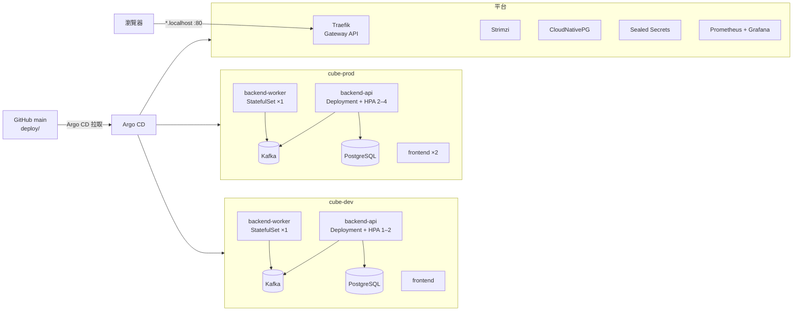

# Kubernetes（本機 k3d + Argo CD）

[← 回到 README](../README.md) · [設定](configuration.md) · [API](api.md) · [測試](testing.md) · [Kubernetes](kubernetes.md) · [CI/CD](cicd.md) · [驗收步驟](acceptance.md)

本頁說明在本機用 k3d 建立 Kubernetes 叢集，並由 Argo CD 從 GitHub 的 `main` 分支部署 dev 與 prod 兩個環境。CI/CD（GitHub Actions、發布、回滾）見 [cicd.md](cicd.md)。

## 叢集裡有什麼



| 項目 | 內容 |
|---|---|
| 叢集 | k3d（k3s v1.35，單一節點，跑在 Docker 裡），內建的 Traefik 關閉，改裝版本固定的 Traefik |
| 對外 | Gateway API + Traefik，主機的 port 80：`cube.localhost`（prod）、`dev.cube.localhost`（dev）、`argocd.localhost`、`grafana.localhost` |
| 後端 | 分成兩個角色：**worker**（StatefulSet，固定 1 個副本：交易所連線、Kafka Streams、寫入、警示、匯率）與 **api**（Deployment + HPA：REST、SSE） |
| 資料 | 每個環境各自一套 Kafka（Strimzi，KRaft）與 PostgreSQL（CloudNativePG），資料放在 PVC |
| 部署 | Argo CD app-of-apps：`deploy/platform/components.tsv` 是唯一的元件清單，`scripts/gen-argocd-apps.py` 產生 `deploy/argocd/apps/`（CI 會檢查兩者一致） |
| 同步 | dev 與平台元件開啟 **selfHeal**（手動改的東西會被改回 Git 的值）；prod **沒有** selfHeal，只在 `main` 有新 commit 時自動同步 |
| 網路 | 每個環境預設拒絕所有進入流量，再逐條允許（同 namespace、Traefik、operator、監控）；dev 連不到 prod |
| 監控 | 兩個環境共用一套 kube-prometheus-stack（`monitoring` namespace），Grafana 儀表板「cube 概覽」，告警 `PriceIngestStalled`、`PricePushStalled`、`IngestDuplicated` |
| 密碼 | Grafana 管理員密碼是 SealedSecret（可以 commit 的加密檔）；資料庫密碼由 CloudNativePG 產生並以 Secret 注入 |

## 需要的環境

- **Docker Desktop**：Settings → Resources，記憶體 **16 GB**（最低 12 GB）、磁碟 60 GB 以上。dev + prod + 平台全部跑起來時，k3d 節點約用 10 GB（實測 9.9 GiB）。若本機還開著 docker compose 版的系統，先停掉以免搶記憶體：`docker compose -p currency down`。
- **工具**：
  ```bash
  brew install k3d helm kustomize kubeseal argocd     # kubectl 由 Docker Desktop 提供
  ```
  `scripts/cluster-up.sh` 至少需要 `docker`、`k3d`、`kubectl`、`helm`（v4）。

## 從零建立叢集

```bash
scripts/cluster-up.sh            # 約 15 分鐘（含下載所有 image；第一次會比較久）
```

腳本會依序：

1. 用 `deploy/k3d/cluster.yaml` 建立 k3d 叢集 `cube`，並把 kubectl 切到這個叢集。
2. 如果 `~/cube-secrets/sealed-secrets-key.yaml` 存在，先還原 Sealed Secrets 的私鑰（見下方〈Sealed Secrets 私鑰〉）。沒有備份時，會為 Grafana 產生一個只在這個叢集有效的隨機密碼。
3. 安裝 Argo CD，套用 `deploy/argocd/root.yaml`。之後由 Argo CD 依 sync wave 從 GitHub 的 `main` 依序部署：Gateway API CRD → 各 operator → Grafana 密碼 → 監控 → 政策與路由 → dev / prod。
4. 等所有 Application 都是 **Synced / Healthy**（最多 25 分鐘），印出各網址與登入方式。

完成後：

| 網址 | 內容 | 登入 |
|---|---|---|
| http://cube.localhost | prod 儀表板 | — |
| http://dev.cube.localhost | dev 儀表板 | — |
| http://argocd.localhost | Argo CD UI | `admin`，密碼：`kubectl -n argocd get secret argocd-initial-admin-secret -o jsonpath='{.data.password}' \| base64 -d` |
| http://grafana.localhost | Grafana | `admin`，密碼：`kubectl -n monitoring get secret grafana-admin -o jsonpath='{.data.admin-password}' \| base64 -d` |

確認全部正常：

```bash
kubectl get applications -n argocd                    # 每一列都是 Synced  Healthy
kubectl get pods -n cube-dev; kubectl get pods -n cube-prod
curl -sN --max-time 5 http://cube.localhost/api/stream | head    # 有 event:price
```

**`*.localhost` 解析不到時**（例如 Safari）：Chrome、Firefox、curl 會自動把 `*.localhost` 指到本機。其他瀏覽器可以在 `/etc/hosts` 加一行（需要 sudo）：

```
127.0.0.1 cube.localhost dev.cube.localhost argocd.localhost grafana.localhost
```

**沒有 GitHub 的本機驗證**：`scripts/cluster-up.sh --mode=direct` 直接用 helm / kubectl 安裝 `components.tsv` 的平台元件（同版本、同設定），不經過 Argo CD，也不安裝 dev / prod 應用。

刪除叢集（**所有資料都會消失**，包含 Kafka、PostgreSQL、Prometheus）：

```bash
scripts/cluster-down.sh
```

## Sealed Secrets 私鑰

repo 裡 commit 的 `*.sealed.yaml` 只有建立它的那個叢集的私鑰能解開。叢集刪掉重建時私鑰會換掉，所以第一次建好叢集後，把私鑰備份到 **repo 外面**：

```bash
scripts/seal-secret.sh --backup-key        # 存到 ~/cube-secrets/sealed-secrets-key.yaml（權限 600）
```

- 之後執行 `scripts/cluster-up.sh` 時會自動還原這個私鑰，既有的 SealedSecret 就能繼續解開。
- **絕對不要 commit 這個檔案**。要確認兩份私鑰是否相同時，只比對雜湊值，例如 `shasum -a 256`。
- 沒有備份就重建了叢集：用新叢集的私鑰重新加密 Grafana 密碼並 commit：
  ```bash
  scripts/seal-secret.sh monitoring grafana-admin admin-user=admin admin-password=@<(openssl rand -base64 18) \
    > deploy/platform/secrets/grafana-admin.sealed.yaml
  ```
  `<key>=@file` 會從檔案讀值，密碼不會留在 shell 歷史裡。

**資料庫密碼**：Kubernetes 上的資料庫密碼由 CloudNativePG 產生（Secret `cube-db-app`），backend 用 `secretKeyRef` 讀取。docker compose 裡的 `currency` 只是本機開發用的預設值（compose 的 PostgreSQL 只在 `internal` 網路，沒有對外 port），Kubernetes 不會用到它。

## 日常操作

一切變更都走 Git：改 `deploy/` 底下的檔案 → 開 PR → 合併到 `main` → Argo CD 在約 1 分鐘內同步。image 版本由 CI 自動更新（見 [cicd.md](cicd.md)），不需要手動改。

```bash
kubectl get applications -n argocd                         # 各元件的同步與健康狀態
kubectl -n cube-prod get pods -o wide
kubectl -n cube-prod logs statefulset/backend-worker -f    # 交易所連線、Streams、寫入
kubectl -n cube-prod logs deploy/backend-api -f            # REST / SSE
kubectl -n cube-prod get hpa backend-api
# 手動同步：在 Argo CD UI 按 Sync，或 argocd login argocd.localhost 之後 argocd app sync cube-prod
```

- **Grafana**：儀表板「cube 概覽」上方的 `namespace` 可以切換 `cube-dev` / `cube-prod`，看 JVM、Kafka consumer lag、價格推送速率。告警規則在 `deploy/monitoring/cube-alerts.yaml`，CI 用 `promtool` 測試（`scripts/test-alert-rules.sh`）。
- **負載測試**（HPA）：`kubectl apply -k deploy/loadtest -n cube-prod` 會跑一次 k6 Job，同時用 `kubectl -n cube-prod get hpa -w` 觀察副本數。Job 完成 10 分鐘後自動刪除。
- **看資料庫**：`kubectl -n cube-prod exec -it cube-db-1 -c postgres -- psql -U postgres -d currency`。

## 禁止的操作

| 不要做 | 原因 | 正確做法 |
|---|---|---|
| 把 `backend-worker` 擴到 1 以上 | worker 持有交易所連線並寫入 Kafka，多個副本會重複寫入價格。ValidatingAdmissionPolicy `cube-single-ingest-worker` 會直接拒絕（包含 `kubectl scale`），另有 `IngestDuplicated` 告警 | 要更多吞吐量時擴 `backend-api`（HPA 自動處理） |
| 在 prod 手動刪除或修改資源 | prod 沒有 selfHeal：刪掉的東西**不會自動補回**，只會在 Argo CD 顯示 OutOfSync，直到下一次 `main` 有新 commit 或手動 Sync | 走 Git；需要恢復時在 Argo CD UI 按 Sync |
| 用 helm / kubectl 直接修 dev 或平台元件 | selfHeal 會在幾秒內改回 Git 的值（曾經發生：手動把 Argo CD controller 的記憶體調大，被改回去而一直 OOM） | 修改進 `main` 之後才會生效 |
| commit 明文 Secret 或 Sealed Secrets 私鑰 | gitleaks 與 GitHub push protection 會擋下；私鑰外洩等於所有 SealedSecret 外洩 | 用 `scripts/seal-secret.sh` 加密後再 commit |

## 疑難排解

- **Pod 一直 `ImagePullBackOff`**：GHCR 的 `cube-backend` / `cube-frontend` package 必須是 **Public**（GitHub → 你的帳號 → Packages → package settings → Change visibility）。叢集沒有設定 pull secret。
- **修好設定後，StatefulSet 的 Pod 還是卡在 `CrashLoopBackOff`**：StatefulSet 不會替換一直沒有 Ready 的舊 Pod，新的 spec 套不上去。先確認 StatefulSet 已經是新的 spec（`kubectl get sts <name> -o yaml`），**確定那個 Pod 真的卡住**之後再刪除它：`kubectl delete pod <name>-0`。
- **Application 卡在 Progressing / OutOfSync**：`kubectl -n argocd get application <name> -o yaml` 看 `status.conditions` 與 `operationState.message`。Argo CD 會以 10 秒起、最長 5 分鐘的間隔無限重試；元件之間依 sync wave 等前一批 Healthy 才繼續。root Application 判斷子 Application 是否 Healthy 時，要求它沒有在同步中，而且最後一次同步成功、版本就是 Git 目前的版本（`deploy/platform/values/argocd.yaml` 的 Lua，測試在 `scripts/test-argocd-health.sh`）。
- **Argo CD controller 被 OOMKilled**：它要快取所有被管理的資源，目前設定 request 512Mi / limit 1Gi（`deploy/platform/values/argocd.yaml`）。
- **新建立的 Pod 第一秒連不到同 namespace 的服務**：k6 測試時觀察過一次，研判是 kube-router 套用 NetworkPolicy 比 Pod 啟動晚約 1 秒（**合理但未證實**）。用戶端重試即可，應用程式本身都有重試。
- **NetworkPolicy 不會切斷已經建立的連線**：k3s 的 kube-router 只對新的連線套用 NetworkPolicy，已建立的長連線（例如 worker 對交易所的 WebSocket）會繼續運作，直到它自己斷線。要讓新的規則立即生效，就要讓 Pod 重新連線（例如刪除 Pod）。這是 task 21 的 AC12 測試中實際觀察到的。
- **刪除 PostgreSQL Pod 後，資料庫約 3 分鐘無法寫入**：CloudNativePG 刪除 Pod 時會先 smart shutdown，等待現有連線結束，最多 180 秒（`smartShutdownTimeout`），之後新的 Pod 才會建立。這段期間 readiness 失敗，worker 寫不進資料庫。資料不會遺失：價格仍在 Kafka，資料庫恢復後 consumer 會補寫。
- **換版時舊的 backend Pod 顯示 `Error`**：屬於正常現象。JVM 因為收到 SIGTERM 而結束時，退出碼是 143（128 + 15），Kubernetes 把任何非 0 的退出碼都標成 `Error`。log 會顯示正常的關閉順序（SSE 連線、Kafka client、資料庫連線池依序關閉），約 5 秒內結束，遠低於 45 秒的 terminationGracePeriodSeconds。
- **記憶體不夠**：dev + prod + 平台全部跑起來時，k3d 節點約用 10 GB。Docker 只分配 8 GB 時，Grafana、Argo CD 等元件可能被 OOMKilled，請調到 16 GB。
